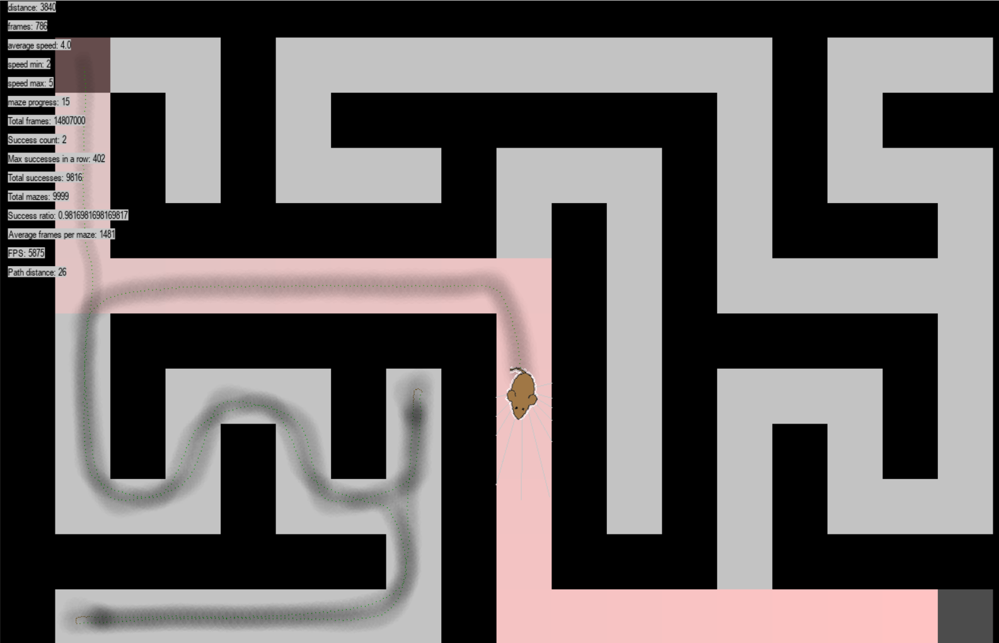

# Not AI mouse in a maze
Following on from "not AI car", which drove around a track, using simple instructions, rather than AI, this is a mouse (originally a car) that has to go from the top left of a maze to the bottom right.

Mazes are generated randomly. The mouse can't properly remember where it has been but it leaves a scent trail behind it, which gradually disappears, so it can tell where it has been for a while:

The simplest instruction would have been to always stick to the left or right wall and the maze would always be solved but that wouldn't be as much fun.

Learning to profile the code (see the notes at the top of the code) was very useful for highlighting areas to improve performance and JIT compilation was great for actually improving it. See [profile.png](profile.png) for an example profile.

The non-AI mouse is pretty good at solving mazes but not perfect, so the next project is to use "AI" to try to do better.